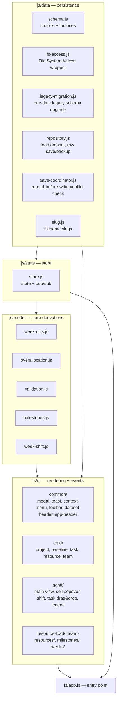

# Architecture

## In one paragraph

Weavo is a static, client-only web app: everything runs in the browser tab, there is no
server-side component, no build step, and no bundler. `index.html` loads a fixed list of plain
`<script>` tags in dependency order; each file attaches its exports to a single global namespace,
`window.MP` (e.g. `MP.schema`, `MP.fsAccess`, `MP.ganttView`). Persistence goes straight from the
browser to a folder on disk via the [File System Access
API](https://developer.mozilla.org/en-US/docs/Web/API/File_System_Access_API) — see
[database.md](database.md) for what's actually stored there.

## Why no modules, no framework, no build

The app must run by double-clicking `index.html` — no `npm install`, no dev server. That single
constraint drives most of the structural decisions here:

- **No `<script type="module">`.** ES module scripts are blocked by CORS when the page is opened
  from a `file://` URL. Every file is a classic script using the IIFE pattern
  `(function (MP) { ... })(window.MP = window.MP || {});`.
- **No bundler, no TypeScript.** There's nothing to compile — the files in `js/` are exactly what
  the browser executes.
- **No IndexedDB.** `indexedDB.open()` never resolves under a `file://` origin in Chromium
  (verified empirically, not a missing optimization), so the app can't use it as a local cache.
- **Explicit load order.** Because there are no imports, `index.html`'s `<script>` list *is* the
  dependency graph. A new file must be inserted at the right point in that list, after everything
  it references and before anything that references it.

## Layers



1. **`js/data/`** — the only layer that touches disk. `fs-access.js` wraps the browser API with
   no application logic; `legacy-migration.js` runs once per folder connect to upgrade data still
   on an older `schemaVersion` (see [database.md](database.md#legacy-data-migration));
   `repository.js` composes these into whole-dataset load and raw per-file save/backup;
   `save-coordinator.js` is the *only* place a user-triggered write should go through, because it
   adds reread-before-write conflict detection (see
   [database.md](database.md#conflict-detection)).
2. **`js/state/store.js`** — a state container in the classic sense: one object, `getState`,
   `setState`, `subscribe`. No framework, no virtual DOM, no reducers. `setState` shallow-merges a
   patch and notifies every subscriber synchronously.
3. **`js/model/`** — pure functions over an in-memory dataset: week arithmetic, the
   cross-project overallocation index, non-blocking validation (orphan references, team
   mismatches), baseline-release-milestone derivation (`milestones.js`, used by the
   milestones page), and the ammissibility check + mutation behind shifting an allocation one
   week back/forward (`week-shift.js`, used by the gantt view's shift feature). No I/O, no DOM
   access, so these are trivially unit-testable in isolation.
4. **`js/ui/`** — rendering and event wiring, split by concern rather than by component
   framework conventions: `common/` (modal, toast, context menu, toolbar — including the current
   page's title next to the hamburger button — dataset-header, app-header), `crud/` (one file per
   entity), `gantt/` (the main grid view), plus one folder per secondary view (resource load,
   team/resource management, milestones density report, week-range controls). The gantt and
   resource-load pages share a header (week range, task/project/upcoming-baseline counts, color
   legend) via `common/dataset-header.js`, so the two views always report identical numbers; the
   upcoming-baseline count is `MP.milestones.countUpcomingBaselines` (release week ≥ today) and the
   milestones page reuses the same header component.
5. **`js/app.js`** — the entry point. Subscribes to the store, maps `state.status` to a render
   function, and owns the initial directory-picker flow. Also renders the static brand header
   (`MP.appHeader`) once at startup into `#app-header`, a sibling of `#app` — it sits outside the
   `state.status` render cycle since its content (logo, product name, version, copyright) never
   changes, and is therefore present on every screen, including `unsupported`/`not-connected`.

## Application state machine

`app.js` renders purely as a function of `state.status`:

```mermaid
stateDiagram-v2
    [*] --> init
    init --> unsupported: File System Access API missing
    init --> not-connected: API supported
    not-connected --> loading: user picks a folder
    loading --> ready: dataset loaded
    loading --> error: load failed
    loading --> not-connected: user cancelled the picker
    error --> not-connected: retry
    ready --> ready: any store update (edits, view switch)
    ready --> not-connected: user picks "Change data folder…" from the ☰ menu
```

`state.dataset` (present only in `ready`) holds `{ manifest, teamResources, projects, warnings }`
plus per-file `*Meta` entries used by the save coordinator. `state.ui.currentView` picks which
top-level view renders inside the `ready` state: the gantt grid, the resource-load view, the
milestones density report, or the team/resource management page.

## Render flow

There's no diffing/virtual DOM: every state change clears `#app` and rebuilds the DOM tree for
the current view from scratch (`appEl.innerHTML = ''` followed by a fresh `renderFn(state)`).
This is deliberate — the datasets involved are small (a handful of projects, at most a couple of
hundred weekly cells), so a full rebuild per update is simpler to reason about than incremental
patching, and it means every view function is a pure `state -> DOM node` mapping with no hidden
lifecycle to track.

Event handlers attached during rendering call into `js/ui/crud/*.js`, which mutate the in-memory
dataset, persist the change via `MP.saveCoordinator`, and then call `setState(...)` to trigger a
re-render — a one-way data flow (state → render → user action → mutation → persist → state).

Since the full rebuild replaces every DOM node, anything not part of `state` would otherwise be
lost on each re-render — notably scroll position. `js/app.js`'s `render()` explicitly saves and
restores the scroll offset of the gantt/resource-load grid's scroll container across a rebuild,
and the gantt view separately tracks which cell was last saved so it can be briefly
re-highlighted after the rebuild, so that editing a week cell doesn't visually "jump" the grid
away from the cell just edited.

## Where to look for a given change

- **New UI affordance on an existing view** → the relevant file under `js/ui/`.
- **New field on the data shape** → start in `js/data/schema.js` (factories + validity helpers),
  thread through `js/data/repository.js`, then the `js/ui/` renderer(s) that display it.
- **Anything that writes a file in response to a user action** → must go through
  `MP.saveCoordinator`, never call `MP.repository.save*` directly, or conflict detection is
  silently skipped.
- **A new kind of cross-cutting warning** (like orphan references) → `js/model/validation.js`,
  surfaced by the gantt view's warnings panel and per-cell badges.
